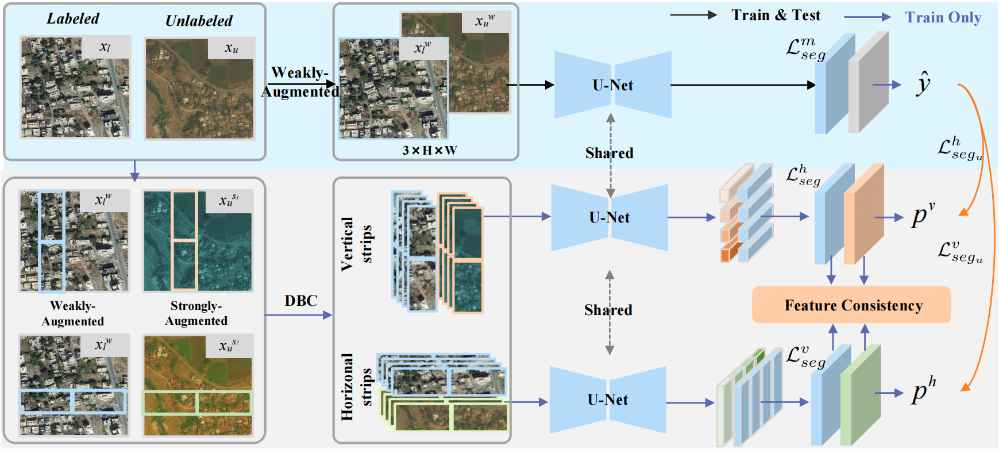

[TGRS 2025] DualStrip-Net: A Strip-based Unified Framework for Weakly- and Semi-Supervised Road Segmentation from Satellite Images


## Getting Started

### Installation

```bash
cd UniMatch
conda create -n dualstrip python=3.10
conda activate unimatch
pip install -r requirements.txt
pip install torch==1.12.1+cu113 torchvision==0.13.1+cu113 -f https://download.pytorch.org/whl/torch_stable.html
```

### Dataset
- [CHN6](https://github.com/CUG-URS/CHN6-CUG-Roads-Dataset)
- Mass
- DeepGlobe

Please modify your dataset path in configuration files.

```
├── [Your CHN6 Path]
    ├── train
        ├── images
        ├── gt
    └── val
        ├── images
        ├── gt
├── [Your DeepGlobe Path]
    ├── train_crops
        ├── images
        ├── gt
    └── val_crops
        ├── images
        ├── gt
├── [Your Massachusetts Path]
    ├── train
        ├── images
        ├── gt
    └── val
        ├── images
        ├── gt
    └── test
        ├── images
        ├── gt
```
## Usage
```bash
CUDA_VISIBLE_DEVICES=0, 1 bash train.sh <num_gpu> <port>
```

## Citation
If you find our code or data helpful, please cite our paper:
```bibtex
@ARTICLE{dualstrip-net,
    author  = {Hu, Jingtao and Li, Qiang and Wang, Qi},
    title   = {DualStrip-Net: A Strip-based Unified Framework for Weakly- and Semi-Supervised Road Segmentation from Satellite Images},
    journal = {IEEE Transactions on Geoscience and Remote Sensin},
    volume  = {65},
    number  = {},
    year    = {2025},
    pages   = {1-14},
}

```
## Acknowledgment
Our implementation is mainly based on following repositories. Thanks for their authors.

* [Unimatch](https://github.com/LiheYoung/ST-PlusPlus](https://github.com/LiheYoung/UniMatch))
